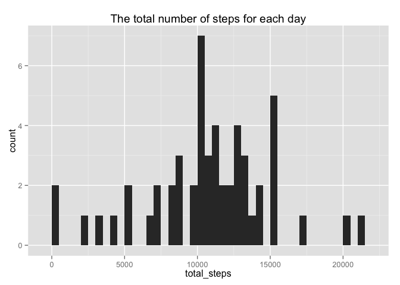
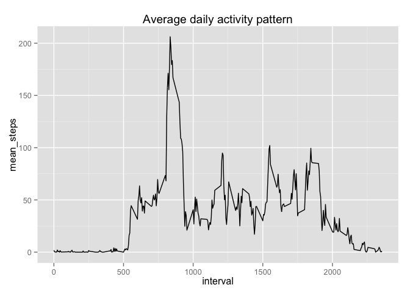
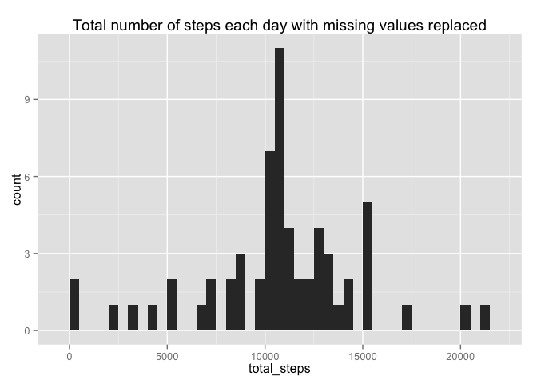
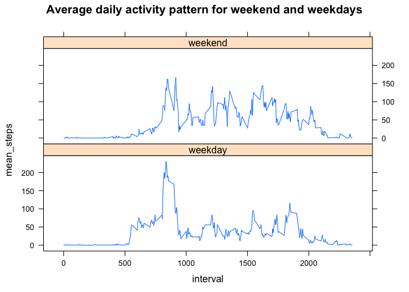

# Reproducible Research: Peer Assessment 1

## Loading and preprocessing the data
The data provided for the assignment consist of measurements of the number of 
steps taken in 5 minute intervals during 2 months. The data is stored in a 
csv file and contains 17586 measurement, with missing values stored as NA. The
data set contains three columns, the number of steps taken, the date and the 
interval number [1].
The data was read by read.csv function and turned into a data.table. NAs were 
removed from the data set.

```r
options(scipen = 1, digits = 2)
library(data.table)
dt <- data.table(read.csv("activity.csv"))
NAsremoved <- dt[complete.cases(dt),]
```
## What is mean total number of steps taken per day?
The number of steps for each day was summed and plotted in a histogram.

```r
library(ggplot2)
sumbydate <- NAsremoved[,list(total_steps=sum(steps)),by=date]
qplot(total_steps, data=sumbydate, geom="histogram",binwidth=500, 
      main="The total number of steps for each day")
```

 

```r
mean = mean(sumbydate[,total_steps])
median = median(sumbydate[,total_steps])
```
The mean of the total number of steps taken each day was 10766.19 and the median
was 10765.

## What is the average daily activity pattern?
The mean number of steps for each interval is plotted as line graph.

```r
averagebyinterval <- NAsremoved[,list(mean_steps=mean(steps)),by=interval]
maxinterval <- averagebyinterval[mean_steps %in% max(averagebyinterval[,mean_steps]),interval]
qplot(x=interval,y=mean_steps, data=averagebyinterval,geom="line",
      main="Average daily activity pattern")
```

 

The interval with the highest mean number of steps was 835.


## Imputing missing values
Missing values were replaced by the average number of steps for the interval.
The total numbers of steps for each day was plotted in a histogram.

```r
numberofNAs <- sum(is.na(dt[,steps]))
replaceNA <- function(steps,mean){
    if (is.na(steps)) {mean}
    else {steps}
}
NAsreplaced <- copy(dt)
# since the data is sorted in interval the mapply function can be used.
NAsreplaced$steps <- mapply(replaceNA,dt$steps,averagebyinterval$mean_steps)
sumbydateNAs <- NAsreplaced[,list(total_steps=sum(steps)),by=date]
meanNAs <- mean(sumbydateNAs[,total_steps])
medianNAs <- median(sumbydateNAs[,total_steps])
qplot(total_steps, data=sumbydateNAs, geom="histogram",binwidth=500,
      main="Total number of steps each day with missing values replaced")
```

 

The mean number of steps taken during a day with the missing values replaced was
10766.19 and the median was 10766.19. Since a day either had all missing
values or a full set of values the mean does not change and the median gets 
closer to the mean, in this case they are the same.


## Are there differences in activity patterns between weekdays and weekends?
The data was split into weekdays and weekends and the mean number of steps for 
each interval was calculated. The activty pattern was
plotted as a time series.  

```r
library(lattice)
# to get english locale on my swedish computer
Sys.setlocale(category = "LC_ALL", "C")
check_weekday <- function(x){
    if(weekdays(x) %in% c("Saturday","Sunday")){"weekend"}
    else{"weekday"}
}
NAsreplaced$day <- as.factor(sapply(as.Date(NAsreplaced$date),check_weekday))
averagebyintervalNAs <- NAsreplaced[,list(mean_steps=mean(steps)),by=c("interval","day")]
xyplot(mean_steps ~ interval | day, data = averagebyintervalNAs, layout = c(1, 2), type="l",
       main="Average daily activity pattern for weekend and weekdays")
```

 


1. The assignment instructions https://class.coursera.org/repdata-010/human_grading/view/courses/973511/assessments/3/submissions
